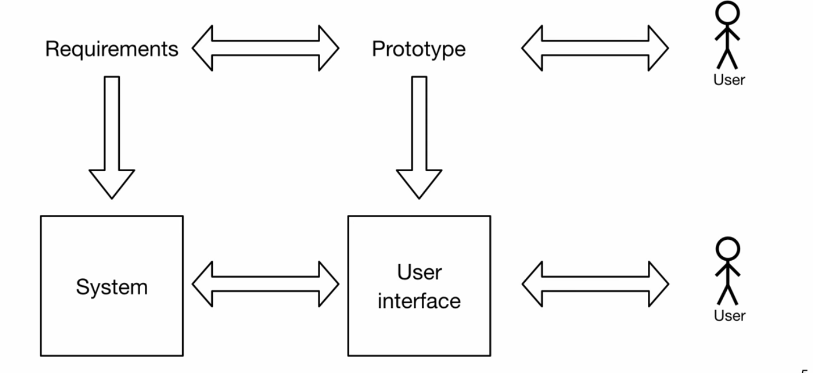

# User Interface Design

The philosophy of good user interface design is to make simple designs that promote self exploration. While the interface should be clean, the main functions should be easily visible and runnable within less interactions. 

One of the approach to designs from Henry Pertovski is that faliure in design is imperative as design is an iterative process so more valuable feedback comes from faliures rather than successes. 

## Prototyping

Prototpying is a process in software and user interface design used early in the design process to recognize and terminate faliures. 

Prototypes are influenced by requirements of the system and can be evaluated by the users. 

While requirements can lead to the software system, the prototypes can be used as a basis for the user interface that hide the complex details of the system to the user and makes the software usable.

Source: [SEECx](https://courses.edx.org/courses/course-v1:TUMx+SEECx+1T2018/courseware/66ff53b993894fcea837c84de9a437dc/215fa958631b44a1b0da1aa2f5806bdb/?child=first)

## Boundary Objects

Boundary objects represent the interactions between the user and the UI constraints. 

Some examples are labels, buttons, lists, tables etc. 

There are a wide variaties of user interface controls in standard libraries and frameworks and there is no need for implementation. 

These boundary objects supported by software frameworks make it easy to create UI and allow for configurations per app basis. They also allow:

* Manipulation of atributes, eg. size, color, shadow
* Manipulation of behaviour by implementing actions

Some of the popular libraries used today are:
* Python: PyQT
* Python: TKinter
* Java: JavaFX

## Best Practices of User Interface Design

* Focus on maximizing usability and user experience: facilitate the task at hand
* Apply general guidelines, but also specialize in the given problem domain
* Analyze users and their activities
* Apply prototyping to iteratively improve the design
* Inspect usability and user experience with real end users

Sources: 
* https://courses.edx.org/courses/course-v1:TUMx+SEECx+1T2018/courseware/66ff53b993894fcea837c84de9a437dc/215fa958631b44a1b0da1aa2f5806bdb/?child=first
* https://courses.edx.org/asset-v1:TUMx+SEECx+3T_2017+type@asset+block@SEECx17_w3u4_User_Interface_Design.pdf