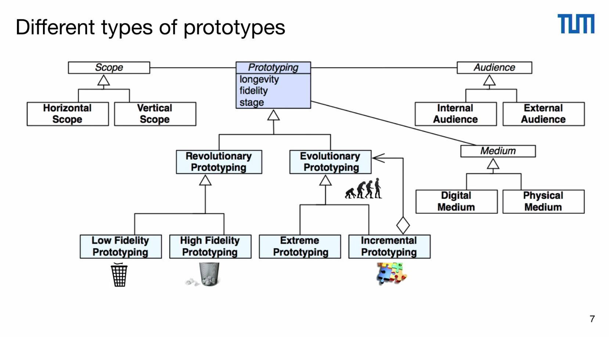

# Prototyping

Software development deals with complex system. Since the developer is not the same person as the user, the design of the software system is complicated and thus they must communicate with the user. 

The user is always right becuase after all the user is the one using the software. This is why prototpying is required to enable software engineers and developers to communicate with users or customers. 

## Types of Prototyping 

Prototyping generally focus on three main characteristics that are longetivity, fidelity and stage of a software system. 

Here is a diagram of the different prototyping options:

### Low Fidelity Prototypes

Low fidelity prototypes don't need much development. These are rough ideas usually on paper that the developer shows to the user/customer.

Advantages:

* Easy to produce
* More feedback
* No design decisions

Disadvantages:

* Mostly not reused
* Important details are ignored

### High Fidelity Prototypes

High fidelity prototypes require more effort and look similar to the actual product.

Advantages:

* More realistic
* More detailed 
* More impressive 

Disadvantages

* Takes more effort
* Less feedback
* High final expactations (especially if design is interactive)

### Horizontal Prototypes

Horizontal prototypes would impleent the bottom (base) layers of the programs by showing a wide range of requirements and a bottom up or top down development approaches are used. These are mostly used in linear processes.

### Vertical Prototypes

Unlike the horozontal prototypes, a small functionality is made fully in all layers of the project. These are used in vertical integration in mostly agile processes.